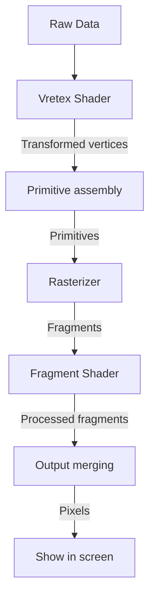

# 图形学学习 软渲染

基于C++实现的软渲染练习，学习[ssloy大佬的软渲染教程](https://haqr.eu/tinyrenderer/)，同时参考了[华中科技大学万琳教授的计算机图形学课程](https://www.icourse163.org/course/HUST-1003636001)。

项目亮点：

- 简易渲染管线的完整模拟
- 完善的顶点着色器与片元着色器模拟
- 基于重心坐标的精确光栅化
- 基于切线空间的法线计算
- Phong与Blinn-Phong关照模型的实现
- Shadowmap算法的完整实践
- SSAO算法的简易实现与集成

实现的管线流程图如下

