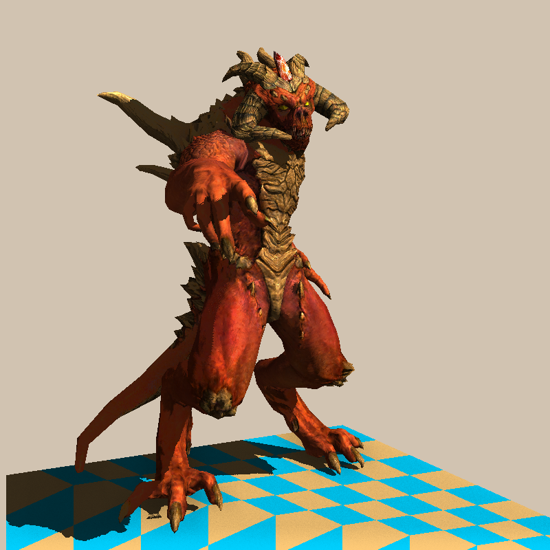
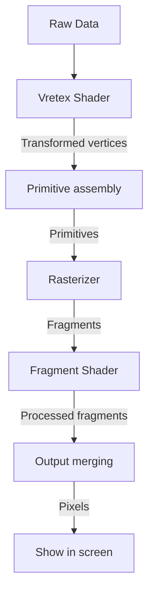

# Tiny Render

## 1. What

基于C++实现的软渲染练习，实现了CPU端的光栅化渲染，模拟了包括顶点着色器、光栅化、片元着色器、后处理在内的流程。前面 `part_` 开头可执行文件均为[ssloy的软渲染教程](https://haqr.eu/tinyrenderer/)对应章节的分步实现，最终综合实现版本请直接运行 `tiny_renderer` 项目。

效果图如下：

项目亮点：

- 简易渲染管线的完整模拟
- 完善的顶点着色器与片元着色器模拟
- 基于重心坐标的精确光栅化
- 基于切线空间的法线计算
- [Phong与Blinn-Phong着色模型的实现](https://plallallla.github.io/summer_bug_wants_ice/#/posts/Phong与Blinn-Phong着色模型.html)
- 屏幕空间Shadowmap算法的完整实践
- SSAO算法的简易实现与集成

## 2. How

请参考博客中的[光栅化渲染管线笔记](https://plallallla.github.io/summer_bug_wants_ice/#/posts/光栅化程序的渲染管线.html)同步观看，本项目实现的管线流程图如下：

## 3. Reference

[ssloy的软渲染教程](https://haqr.eu/tinyrenderer/)

[华中科技大学万琳教授的计算机图形学课程](https://www.icourse163.org/course/HUST-1003636001)

[GAMES101](https://www.bilibili.com/video/BV1X7411F744/?spm_id_from=333.788.videopod.episodes&vd_source=35656623bbb678de699bcd2742ccb713)
