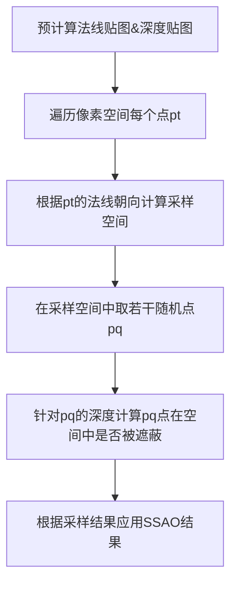

# Screen-Space Ambient Occlusion

#### 0.why

在传统的phong光照模型中，环境光是一个固定的值，他不受外界的任何影响，这与我们生活中的常识相反。比如在墙壁的角落，虽然没有任何光线照亮，但由于环境光的影响，这个角落并不会是漆黑一片，而是亮度相对较暗地反应着墙角的颜色。因此我们需要找到一种办法来计算环境光在全局环境下是否被遮挡，如果被遮挡又遮挡了多少。

#### 1.what

SSAO（Screen-Space Ambient Occlusion） 是一种用于模拟物体表面“角落”或“缝隙”处光线被遮挡的效果的技术。它让场景看起来更真实：比如墙角、凹陷处会变暗，而平坦区域保持明亮。它是一种基于屏幕空间进行的逐像素的后处理。

#### 2.how

针对像素上的一点，我们可以将它还原到世界坐标下，然后围绕着他周围的一个空间内进行采样，计算周围的采样点是否会对这个点进行遮挡。然后依据采样结果来决定降低多少这个点的环境光。这样的步骤就要求我们需要预先计算法线贴图与深度贴图，法线贴图决定要进行采样点空间在哪个方向，深度贴图用于计算采样点与原点点遮蔽关系。基本流程如下



实现时的代码如下
```c++
    constexpr double ao_radius = .1;  // ssao ball radius in normalized device coordinates
    constexpr int nsamples = 128;     // number of samples in the ball
    std::random_device rd;
    std::mt19937 gen(rd());
    std::uniform_real_distribution<double> dist(-ao_radius, ao_radius);
    auto smoothstep = [](double edge0, double edge1, double x) 
    {         // smoothstep returns 0 if the input is less than the left edge,
        double t = std::max(0.0, std::min(1.0, (x - edge0)/(edge1 - edge0)));  // 1 if the input is greater than the right edge,
        return t*t*(3 - 2*t);                                        // Hermite interpolation inbetween. The derivative of the smoothstep function is zero at both edges.
    };

#pragma omp parallel for
    for (int x=0; x<width; x++) 
    {
        for (int y=0; y<height; y++) 
        {
            double z = zbuffer[x+y*width];
            if (z < -100)
            {
                continue;
            }
            vec4 fragment = Viewport.invert() * vec4{(double)x, (double)y, z, 1.};
            double vote = 0;
            double voters = 0;
            for(int i = 0; i < nsamples; i++) 
            {
                vec4 p = Viewport * (fragment + vec4{dist(gen), dist(gen), dist(gen), 0.});
                if (p.x<0 || p.x>=width || p.y<0 || p.y>=height)
                {
                    continue;
                }
                double d = zbuffer[int(p.x) + int(p.y)*width];
                if (z + 5 * ao_radius < d)// range check to remove the dark halo
                {
                    continue;
                }
                voters++;
                vote += d > p.z;
            }
            double ssao = smoothstep(0, 1, 1 - (vote / voters) * .4);
            TGAColor c = framebuffer.get(x, y);
            framebuffer.set(x, y, { (std::uint8_t)(c[0]*ssao), (std::uint8_t)(c[1]*ssao), (std::uint8_t)(c[2]*ssao), c[3] });
        }
    }
```

##### dark halo的产生原因与解决方法

当采样区域的实际深度不连续时，比如一个物体A更大更远，但是一个更小更近的物体B遮住了他，这时B边缘上的一点在采样时，实际的采样空间会出现深度的突变（从B深度变为A深度）。这样采样会出现这边的点都被判定为遮蔽，从而ssao采样结果会变大，从而出现一圈黑色的边。上面的代码通过一个范围检查，来放弃了一些深度差异太大的点，这样可以在一定程度上避免dark halo的产生。

##### 后续的优化

通常的SSAO计算出来只是一个近似的结果，会存在着走样与大量噪点，后续需要通过后处理滤波（如高斯模糊、双边滤波等）来达到降噪与反走样的效果。
